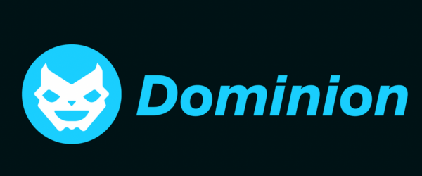

# Dominion: Decentralized Community Owned Gaming Hub.

Dominion is a one-of-its-kind decentralized gaming platform built on a Cosmos SDK blockchain and Leveraging Cosmwasm & Zero-Knowledge-Proofs. This platform offers a secure, transparent, and trustless environment for gamers, developers, and other stakeholders in the gaming ecosystem. With Dominion, users can enjoy a seamless gaming experience while benefiting from the underlying blockchain technology, which ensures fairness, security, and interoperability with other platforms through the Inter-Blockchain Communication (IBC) protocol.

## Getting Started

To run the Dominion blockchain, follow these basic steps:

### Prerequisites

- Install [Go](https://golang.org/doc/install) (version 1.17 or later)
- Install [Ignite CLI](https://tutorials.cosmos.network/hands-on-exercise/1-ignite-cli/1-ignitecli.html) (version 0.25.2 or later) by running:
  ```
  $ curl https://get.starport.network/cli! | sudo bash
  ```

### Steps to Run the Chain

1. Clone the Dominion repository:
   ```
   $ git clone https://github.com/dominionhub/core.git
   ```

2. Change into the Dominion directory:
   ```
   $ cd dominionhub
   ```

3. Build the Dominion binary:
   ```
   $ ignite build
   ```

4. Initialize the Dominion node:
   ```
   $ ./dominiond init [moniker] --chain-id dominion
   ```

5. Start the Dominion node:
   ```
   $ ./dominiond start
   ```

Now, the Dominion blockchain should be up and running.

### Alternatively (For Dev)

You can also use 
```
ignite chain serve 
```

## About Dominion

Dominion aims to revolutionize the gaming industry by providing a decentralized platform where gamers, developers, and other stakeholders can interact in a transparent and secure manner. This platform leverages the power of the Cosmos SDK and Tendermint consensus algorithm to create a highly scalable and interoperable blockchain solution designed specifically for gaming applications.

Some key features of the Dominion platform include:

- **Decentralized Governance**: Dominion's governance model allows for community-driven decision-making, ensuring that the platform remains fair and balanced for all users.
- **Interoperability**: Utilizing the IBC protocol, Dominion can seamlessly connect with other blockchains, enabling cross-chain communication and asset transfers.
- **Scalability**: Built on the Cosmos SDK, Dominion can handle a large number of transactions and users, ensuring a smooth gaming experience for all participants.

Dominion is poised to disrupt the gaming industry by providing a decentralized, secure, and scalable platform for the next generation of gaming applications. By leveraging the power of blockchain technology, Dominion aims to create a thriving ecosystem that benefits gamers, developers, and other stakeholders in the gaming world.
